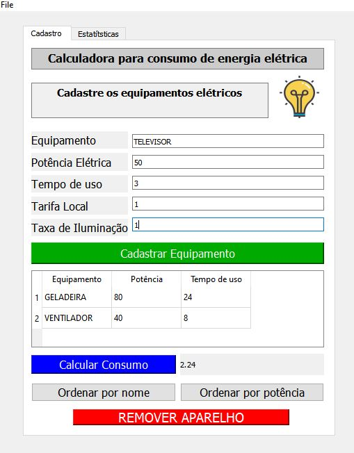

#  Calculadora para consumo de energia

## O presente projeto foi elaborado utilizando a plataforma do QT CREATOR, e tem como finalidade a composição de nota da disciplina técnicas de programação 2019.2

#### O projeto tem como objetivo calcular o consumo de energia a partir das informações provenientes do cadastro dos equipamentos elétricos de uma unidade de consumo.

## Algoritimo
### Passo 1. Cadastrar os equipamentos elétricos da unidade de consumo

####     -Identificação do equipamento
####     -Potência do equipamento
####     -Tempo de uso diário do equipamento
####     -Tarifa cobrada pela distribuidora na região
####     -Taxa de iluminação pública

### Passo  2. Calcular uma estimativa da fatura do mês

####     -Resultado na tela

### Passo 3. Verificar se está dentro de uma faixa próxima da sua conta de energia real

####     -Caso o resultado obtido esteja próximo do real;
####          -Ótimo sua instalação elétrica e seus equipamentos estão em perfeito estado de funcionamento

####     -Caso o resultado obtido esteja distante do real;
####          -Refaça os cálculos você pode ter errado algum dado dos equipamentos

####     -Caso o resultado obtido continue distante do real;
####          -Faça uma revisão no circuito elétrico ou verifique o estado dos seus equipamentos.

## Fim do Algoritimo

###     -Na segunda aba está localizado os dados que mostram as estatísticas do processo
  ####          -Tais como:
   ####          -A maior potência da carga
   ####          -A menor potência da carga
   ####          -A potência média
   
   
   
  ####          -Por fim o app é direcionado para quem deseja obter um maior controle sobre a conta de energia, evitando assim dispedicíos de energia.
            
