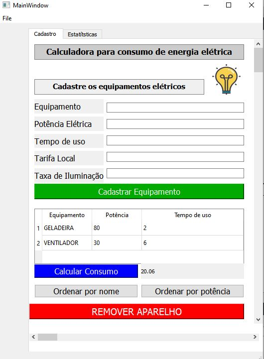
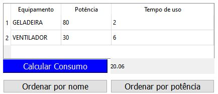
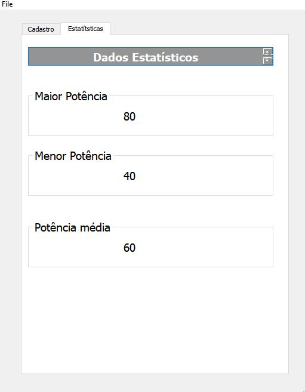

#  Calculadora para consumo de energia

## O presente projeto foi elaborado utilizando a plataforma do QT CREATOR, e tem como finalidade a composição de nota da disciplina técnicas de programação 2019.2

### O projeto tem como objetivo calcular o consumo de energia a partir das informações provenientes do cadastro de equipamentos elétricos de uma unidade de consumo.

## Algoritimo
### Passo 1. Cadastrar os equipamentos elétricos da unidade de consumo

####     -Identificação do equipamento
####     -Potência do equipamento
####     -Tempo de uso diário do equipamento
####     -Tarifa cobrada pela distribuidora na região
####     -Taxa de iluminação pública

####     A conta de energia é faturada calculando o consumo mensal em KW/h, exemplificando se você utiliza um equipamento com potência de 60 W durante 60 min, você terá consumido 0,06 KW/h que é a potência consumida pelo seu aparelho, tal potência terá que ser multiplicada pelo valor do KW/h cobrado em sua região, resumindo obedece a seguinte fórmula;

###   E = (KW * (TEMPO DE CONSUMO) * (VALOR DO KW/h)) + TAXA DE ILUMINAÇÃO ; 

### Passo  2. Calcular uma estimativa da fatura do mês

#### A estimativa da fatura tem como finalidade fornecer uma base de informações que permitirá ao usúario uma tomada de decisão, a parti de uma análise dessas informações pode se planejar uma ecônomia de uso dos aparelhos, ou a substituição visando uma maior eficiência de consumo.

####     -Resultado do consumo na tela

### Passo 3. Verificar se está dentro de uma faixa próxima da sua conta de energia real

####     -Caso o resultado obtido esteja próximo do real;
####          -Ótimo sua instalação elétrica e seus equipamentos estão em perfeito estado de funcionamento

####     -Caso o resultado obtido esteja distante do real;
####          -Refaça os cálculos você pode ter errado algum dado dos equipamentos

####     -Caso o resultado obtido continue distante do real;
####          -Faça uma revisão no circuito elétrico ou verifique o estado dos seus equipamentos.

## Fim do Algoritimo

####  O programa fornece algumas funções aos usuários, além de cadastrar vários aparelhos, ele poderá deletar aparelhos da lista ou banco de dados, poderá ordenar a lista em ordem alfabética ou segundo a potência do aparelho.

###     -Na segunda aba está localizado os dados que mostram as estatísticas do processo
  ####          -Tais como:
   ####          -A maior potência da carga
   ####          -A menor potência da carga
   ####          -A potência média
   
   
   
  ####          -Por fim o app é direcionado para aqueles que desejam obter um maior controle sobre a conta de energia, evitando assim o seu dispedicío.
  
 ## Obrigado!
            
